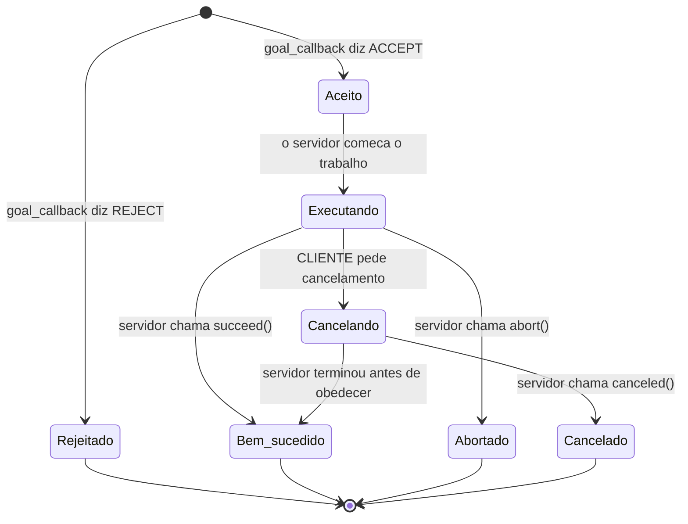

# Aula 8 — Ações a fundo: o ciclo de vida de um objetivo

**Terça, 08/09/2026 · sala SJ205 · Etapa 4 (31/08–12/09)**

[:material-file-pdf-box: Slides da Aula 8 (PDF)](apresentacao-aula08.pdf){ .md-button .md-button--primary }
[:material-code-tags: Exemplo `aula07-acoes`](../../exemplos/aula07-acoes/index.md){ .md-button }
[:material-clipboard-check: Tarefa da semana](../../tutoriais/tarefa-aula07-acoes.md){ .md-button }

!!! warning "Os dois gates mais reprovadores do TP2 fecham nesta aula"
    **G2.2** vence em 12/09 e **G2.3** em 16/09. O G2.3 não pede código de cancelamento escrito — pede cancelamento **demonstrado**, e a diferença entre as duas coisas é o assunto da Parte 4.

## Onde paramos

Na aula passada os cartões funcionaram: uma folha levantada, um serviço chamado, um banner no terminal. E ficou a pergunta que aquele demo não conseguia responder — *e quando o comando não é instantâneo?*

Serviço é pergunta e resposta. Levantar a folha e receber "PARAR" acontece em milissegundos, e por isso funciona. Agora troque o comando: em vez de "pare", peça **"vá até a bancada e me avise quando chegar"**. O serviço trava quem pediu por trinta segundos, sem dizer nada, e não pode ser interrompido. Foi aí que o nome *action* apareceu, e é aí que a aula de hoje começa.

## A ideia da aula em uma frase

**Um objetivo não é uma mensagem: é uma entidade, com identidade e com estado.** Essa é a diferença conceitual que separa action de tudo que vocês usaram até agora, e tudo o mais — feedback, cancelamento, o servidor com três callbacks — decorre dela.

## Objetivos

Ao final da aula você deve conseguir explicar por que um objetivo tem identidade e um tópico não; percorrer a máquina de estados de um objetivo e dizer, em cada transição, quem a provocou; distinguir **sucesso**, **abortado** e **cancelado**, e justificar por que confundir os dois últimos quebra o cliente; implementar um servidor com as três decisões separadas; e demonstrar um cancelamento que **realmente** interrompe a tarefa — explicando por que a versão ingênua não interrompe e não dá erro.

## Baixar o material desta aula

```bash
# 1) baixar o material (pode repetir sempre — a linha do rm evita o erro de pasta já existente)
rm -rf /tmp/PBRoboticos_prof_dacio
cd /tmp && git clone --depth 1 https://github.com/Prof-Dacio-INFNET/PBRoboticos_prof_dacio.git

# 2) copiar. O pb_interfaces vem DE NOVO porque ele cresceu de novo
cp -r /tmp/PBRoboticos_prof_dacio/exemplos/aula06-interfaces/pb_interfaces \
      /tmp/PBRoboticos_prof_dacio/exemplos/aula06-interfaces/aula06_percepcao \
      /tmp/PBRoboticos_prof_dacio/exemplos/aula07-acoes/aula07_acoes \
      ~/projeto-pb-SEU-USUARIO/ros2_ws/src/

# 3) compilar no SEU workspace — interfaces primeiro, sempre
cd ~/projeto-pb-SEU-USUARIO/ros2_ws
colcon build --packages-select pb_interfaces
source install/setup.bash
colcon build --packages-select aula06_percepcao aula07_acoes --symlink-install
source install/setup.bash
```

!!! tip "Rode antes de modificar"
    Compile e rode o exemplo **como ele veio**, antes da sua primeira alteração. Quando algo quebrar depois, você sabe que o problema é seu e não do exemplo.

## Parte 1 — O que é, de fato, uma action

A resposta fácil é "é a terceira forma de comunicação do ROS 2". Ela é verdadeira e não ajuda a decidir nada. A resposta útil compara as três por duas propriedades que a maioria das apresentações não menciona: **identidade** e **estado**.

| | Tópico | Serviço | Action |
|---|---|---|---|
| A coisa trocada tem **identidade**? | não — mensagem é evento anônimo | não — a chamada termina e some | **sim**: cada objetivo tem um `goal_id` |
| Tem **estado observável**? | não | não | **sim**: uma máquina de estados |
| Quem pode **terminar**? | ninguém termina nada | o servidor, uma vez | o servidor **ou** o cliente |
| Existe resultado **parcial**? | — | não | **sim**: feedback |
| Duração típica | contínua | milissegundos | segundos a minutos |

Repare que as três primeiras linhas são a mesma ideia vista de ângulos diferentes. **Porque o objetivo tem identidade, dá para falar sobre ele depois de criado** — perguntar como está indo, mandar parar, receber o desfecho. Uma mensagem publicada num tópico não pode ser cancelada porque não existe *ela*: existe um fluxo. Uma chamada de serviço não pode ser consultada porque, do ponto de vista de quem chamou, ela é um instante.

!!! note "O teste de uma frase"
    Pergunte-se: *depois de mandar, eu vou querer me referir a isso de novo?* Se sim — para acompanhar, para cancelar, para saber como terminou — é action. Se não, tópico ou serviço resolvem, e resolvem com muito menos código.

### A máquina de estados de um objetivo

Este é o mapa que faltava na aula passada. Cada seta tem um responsável, e é isso que importa:



A mesma máquina, em forma de tabela — porque na hora de depurar é a coluna da direita que você vai querer:

| Transição | Quem provocou | Como aparece no código |
|---|---|---|
| → Rejeitado | o **servidor**, antes de gastar nada | `return GoalResponse.REJECT` |
| → Aceito | o **servidor** | `return GoalResponse.ACCEPT` |
| Aceito → Executando | o **servidor** | entra o `execute_callback` |
| Executando → Bem-sucedido | o **servidor**, porque a condição ocorreu | `goal_handle.succeed()` |
| Executando → Abortado | o **servidor**, porque desistiu | `goal_handle.abort()` |
| Executando → Cancelando | o **cliente** | `cancel_goal_async()` do lado de lá |
| Cancelando → Cancelado | o **servidor**, obedecendo | `goal_handle.canceled()` |

Duas leituras que valem parar:

**Rejeitado não é um fim de execução — é a ausência dela.** O objetivo nunca começou, nada foi gasto, e o cliente sabe disso imediatamente. Um servidor que aceita tudo e depois falha desperdiça o trabalho de todo mundo e informa pior.

**`Cancelando` é um estado, não um instante.** O cliente pede; o servidor decide se aceita e, aceitando, ainda precisa chegar num ponto seguro para parar. Entre o pedido e o `Cancelado` existe tempo — e num robô físico esse tempo é onde mora a segurança.

## Parte 2 — Os três verbos de término, e por que confundi-los quebra o cliente

Todo caminho de saída do `execute_callback` precisa chamar exatamente um destes:

| Verbo | Significado | Quem decidiu |
|---|---|---|
| `succeed()` | a tarefa foi cumprida | o servidor, porque a condição de sucesso ocorreu |
| `abort()` | o servidor **desistiu**: a tarefa deixou de ser possível | o servidor, contra a vontade do cliente |
| `canceled()` | alguém pediu para parar e o servidor obedeceu | o cliente, honrado pelo servidor |

**Abortado e cancelado terminam a tarefa do mesmo jeito e significam coisas opostas.** Cancelado quer dizer *mudei de ideia* — o sistema está saudável, e quem pediu sabe por quê. Abortado quer dizer *não deu, e não foi você que pediu* — algo quebrou, e quem pediu precisa decidir o que fazer.

Um cliente que trata os dois igual toma a decisão errada em um dos casos: ou fica tentando de novo uma tarefa que o operador cancelou de propósito, ou desiste em silêncio de uma tarefa que falhou por um motivo que dava para corrigir.

!!! warning "O erro mais comum: sair do laço sem fechar o objetivo"
    Um `return` no meio do `execute_callback` sem `succeed()`, `abort()` ou `canceled()` deixa o cliente **pendurado para sempre**, esperando um resultado que nunca vem. Não há erro, não há aviso, não há timeout automático.

    É a mesma família do bug da Parte 4: o comportamento ausente não produz erro.

### Abortar ao vivo

O servidor do exemplo aborta quando a percepção fica muda. Varrer a cena sem imagem não é uma varredura ruim — é uma varredura que **não está acontecendo**, e essa distinção é o que justifica abortar em vez de devolver zero.

```bash
# terminal 1
ros2 launch aula07_acoes varredura.launch.py

# terminal 2 — comece uma varredura longa
ros2 action send_goal /varrer_cena pb_interfaces/action/VarrerCena \
  "{duracao_s: 60.0, classe_alvo: 'objeto_alvo', minimo_para_parar: 0}" --feedback

# terminal 3 — mate a percepcao no meio
pkill -f 'aula06_percepcao.*detector'
```

Em três segundos o objetivo termina com **ABORTED** e um resumo dizendo por quê. Compare com o `Ctrl+C` no cliente, que termina com **CANCELED**: mesmo fim, motivos opostos, e o cliente consegue diferenciar.

### Um objetivo por vez

O `goal_callback` do exemplo rejeita um novo objetivo enquanto outro está em curso. Não é limitação — é política. Por padrão o `rclpy` aceita quantos objetivos chegarem e executa todos em paralelo, o que quase sempre está errado num robô físico: ele tem um braço só.

```bash
# com uma varredura ja rodando, peca outra:
ros2 action send_goal /varrer_cena pb_interfaces/action/VarrerCena \
  "{duracao_s: 5.0, classe_alvo: 'objeto_alvo', minimo_para_parar: 0}"
# -> Goal was rejected
```

O comentário no código admite onde essa solução simples quebra: `ocupado` só vira verdadeiro quando a execução começa, então dois pedidos no mesmo milissegundo passam os dois. Para uma aula, a janela é irrelevante; para um robô, a serialização correta vive no `handle_accepted_callback`, com fila. **Saber onde a sua solução simples quebra faz parte de escolher a solução simples.**

## Parte 3 — Anatomia e servidor, com todo mundo rodando

O `.action` tem três blocos separados por `---`: **Goal** (o que se pede), **Result** (o que volta no fim) e **Feedback** (o que volta durante). O arquivo mora no mesmo `pb_interfaces` das aulas anteriores — interface não ganha pacote novo a cada aula, o pacote do projeto cresce.

O servidor tem três pontos de decisão, e cada um responde a uma pergunta diferente: `goal_callback` aceita ou rejeita **antes** de gastar qualquer coisa; `cancel_callback` decide se o cancelamento é honrado; `execute_callback` é o laço.

Dentro do laço, a ordem importa mais que o conteúdo:

```python
while True:
    if goal_handle.is_cancel_requested:      # 1. cancelamento SEMPRE primeiro
        goal_handle.canceled()
        return resultado_parcial
    if percepcao_muda:                       # 2. desistir e decisao do servidor
        goal_handle.abort()
        return resultado_parcial
    ...                                      # 3. o trabalho
    if condicao_de_sucesso:                  # 4. sucesso antecipado
        goal_handle.succeed()
        return resultado
    goal_handle.publish_feedback(fb)         # 5. feedback
    time.sleep(PERIODO_S)                    # 6. dormir um pouco
```

Checar cancelamento no fim em vez do começo faz o servidor demorar um ciclo inteiro para obedecer. Com 200 ms ninguém nota; com dois segundos, o operador aperta parar e o robô anda mais dois segundos.

### A armadilha do terminal sem `source`

!!! danger "`The passed action type is invalid` — e as duas linhas que enganam"
    Se o `send_goal` responder isso, quase sempre **não é** a action que está errada: é o terminal.

    Repare no que acontece num terminal sem `source install/setup.bash`:

    ```bash
    ros2 action list                      # /varrer_cena          <- FUNCIONA
    ros2 action info /varrer_cena -t      # tipo certo, servidor  <- FUNCIONA
    ros2 action send_goal ... VarrerCena  # The passed action type is invalid
    ros2 run aula07_acoes cliente_varredura   # Package 'aula07_acoes' not found
    ```

    As duas primeiras funcionam porque **perguntam ao grafo** pela rede: elas leem o que o servidor anuncia e nunca precisam do seu código. As duas últimas precisam **importar o tipo** e **achar o pacote** na sua máquina, e é aí que a falta do `source` aparece.

    Essa é a armadilha: **as ferramentas que funcionam te convencem de que o ambiente está certo.** A mensagem "action type is invalid" te manda olhar para o `.action`, que está perfeito.

    Diagnóstico em cinco segundos:

    ```bash
    python3 -c "from pb_interfaces.action import VarrerCena; print('interfaces ok')"
    ros2 pkg list | grep aula07_acoes
    ```

    Se o primeiro der `ModuleNotFoundError` ou o segundo não imprimir nada, a cura é sempre a mesma, **neste terminal**:

    ```bash
    cd ~/projeto-pb-SEU-USUARIO/ros2_ws
    source install/setup.bash
    ```

    Quem cansar de repetir pode pôr essa linha no `~/.bashrc`. O preço é que ela esconde o problema no dia em que você tiver dois workspaces — e aí o sintoma volta, mais confuso.

## Parte 4 — O bug que não dá erro

Escreva um servidor correto em tudo: `cancel_callback` aceitando, `is_cancel_requested` no lugar certo, `canceled()` chamado. Rode. Peça cancelamento. **Não cancela.** E não aparece erro nenhum, em lugar nenhum.

A causa está fora do código da action. Por padrão o `rclpy` roda com um executor de **uma thread só**. Quando o `execute_callback` entra em execução, ele ocupa essa thread até terminar. O pedido de cancelamento chega, entra na fila, e espera a thread ficar livre — o que só acontece quando a tarefa acaba sozinha. O `is_cancel_requested` nunca vira verdadeiro porque nada nunca o setou.

A cura são duas linhas, e as duas são necessárias:

```python
from rclpy.callback_groups import ReentrantCallbackGroup
from rclpy.executors import MultiThreadedExecutor

callback_group=ReentrantCallbackGroup()              # no ActionServer
rclpy.spin(no, executor=MultiThreadedExecutor())     # no main()
```

!!! danger "Faça você mesmo, agora, e veja não funcionar"
    Comente as duas linhas no `servidor_varredura.py`, recompile, e tente cancelar. **Ver a coisa não funcionar, sem nenhuma mensagem, é o que fixa a lição.**

    E generalize: teste procura erro. Funcionalidade que simplesmente **não acontece** só aparece se você a exercitar de propósito. É por isso que o G2.3 pede cancelamento demonstrado — um print de código não prova nada.

## Parte 5 — Introdução à percepção veicular

Os quinze minutos finais abrem o assunto da próxima aula, e ele começa por uma pergunta que o seu pipeline atual não consegue responder.

O Demo 1 da aula passada achava a maior mancha vermelha e dizia onde ela estava **em pixels**. Pixel é coordenada na imagem, e um robô não anda em pixels. A pergunta que trava todo projeto de percepção mais cedo ou mais tarde é:

> *"Esse objeto que a câmera viu está a que distância da roda?"*

Percepção veicular é o nome que se dá a resolver isso num veículo em movimento, e ela junta três coisas que vocês vão ver separadas antes de ver juntas.

**Detectar melhor do que por cor.** Segmentação por HSV responde "onde há vermelho". Um carro não é vermelho, um pedestre não é vermelho, e uma placa de pare é vermelha e um pano vermelho também. Detectar exige um modelo treinado, e com ele vem uma obrigação nova: **declarar uma métrica**. "Ficou bom" deixa de ser resposta aceitável — é isso que o gate **G2.4** cobra, e é o assunto de 15/09.

**Saber onde as coisas estão.** Não basta detectar: é preciso situar a detecção no espaço do robô. Isso é **TF**, e a descrição de onde cada sensor está montado é **URDF**. Sem isso, "vi um obstáculo" não vira "freie", porque ninguém sabe se o obstáculo está a dois metros ou a vinte centímetros.

**Decidir com atraso.** Num veículo, entre ver e agir existe tempo — de captura, de processamento, de atuação. Vocês já mediram o primeiro na Aula 3 e já discutiram o terceiro hoje, quando falamos que checar o cancelamento no fim do laço custa um ciclo. Num robô de bancada isso irrita; a 30 km/h, isso é distância percorrida.

!!! tip "O que fazer nesta semana"
    O URDF e a TF **não** vão ser apresentados do zero na aula que vem — o tutorial já está publicado, e a Aula 9 será clínica em cima dele:

    **[URDF, TF e RViz2 — do zero ao robô na tela](../../tutoriais/urdf-tf-rviz2.md)**

    Ele começa na instalação (`joint-state-publisher-gui`, `xacro`, `tf2-tools`, `check_urdf`), monta um robô com câmera, e termina com a árvore de TF validada. Faça antes de 15/09 e chegue com o modelo aparecendo no RViz2 — quem chegar sem isso vai gastar a aula instalando pacote.

## Parte 6 — O que isso vira daqui para frente

No TP2, **G2.2** e **G2.3** são exatamente esta aula. O documento de gates avisa da armadilha — *"implementar a Action como um publisher com nome bonito"* — e agora vocês sabem qual é o teste que separa uma coisa da outra: se o seu servidor não pode ser parado no meio, ele não é uma action, é um serviço lento com mais código.

No resto do semestre, ação deixa de ser assunto e vira infraestrutura. O `NavigateToPose` do Nav2 é uma action: o objetivo é a pose de destino, o feedback é a distância restante, o cancelamento é o botão de parar, e o **abort** é o robô dizendo que não achou caminho. Quando chegarmos lá, vocês não vão aprender navegação e ações ao mesmo tempo.

## Tarefa da semana

[Tarefa da Aula 7 — a ação do seu projeto](../../tutoriais/tarefa-aula07-acoes.md) continua valendo, e agora com dois itens a mais que saem desta aula: o seu servidor deve **rejeitar** um objetivo inválido e **abortar** quando a tarefa deixar de ser possível. Grave a evidência dos três desfechos — sucesso, cancelamento e abort.

## Socorro rápido

| Sintoma | Causa provável |
|---|---|
| **o cancelamento não faz nada, e não há erro** | executor de uma thread só — [Parte 4](#parte-4-o-bug-que-nao-da-erro) |
| o cliente fica pendurado para sempre | algum caminho de saída do `execute_callback` não chamou `succeed()`, `abort()` nem `canceled()` |
| tudo vira `ABORTED` logo no começo | a percepção não está no ar; use o `varredura.launch.py`, que sobe os dois nós |
| `Goal was rejected` | pode ser sucesso: duração fora da faixa, ou já existe uma varredura em curso |
| o cancelamento demora um ciclo | `is_cancel_requested` está no fim do laço; mova para o começo |
| **`The passed action type is invalid`** no `send_goal` | terminal sem `source install/setup.bash`. O `action list` e o `action info` continuam funcionando, porque perguntam ao grafo — [veja o aviso acima](#a-armadilha-do-terminal-sem-source) |
| `Package 'aula07_acoes' not found` no `ros2 run` | mesma causa: o overlay do workspace não está neste terminal |
| `ModuleNotFoundError: pb_interfaces.action` | compilou mas não deu `source install/setup.bash` neste terminal |
| erro de compilação citando `action_msgs` | falta a dependência no `package.xml` **e** no `DEPENDENCIES` do CMake |
| feedback não aparece | faltou a flag `--feedback` no `send_goal` |
| `ros2 topic hz` com `min:` negativo | relógio do WSL2 saltando — [diagnóstico e cura](../../tutoriais/setup-ros2-humble-wsl2.md#o-relogio-do-wsl2-pode-saltar-e-isso-estraga-qualquer-medicao) |

## Para a próxima aula (15/09)

**Percepção veicular: detecção treinada e métrica declarada** (gate **G2.4**, vence 19/09) e **clínica de URDF e TF** (gate **G2.5**, vence 22/09).

A Aula 9 carrega dois gates, então parte dela virou leitura prévia. **Faça o tutorial [URDF, TF e RViz2](../../tutoriais/urdf-tf-rviz2.md) antes de 15/09** — ele começa na instalação e termina com a árvore de TF validada. Quem chegar sem ele vai gastar a aula instalando pacote em vez de resolvendo o próprio modelo.

Chegue também com a sua action funcionando nos três desfechos: sucesso, cancelamento e abort.
